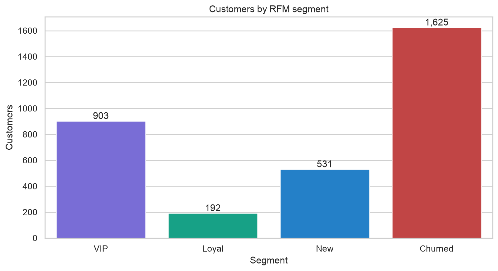
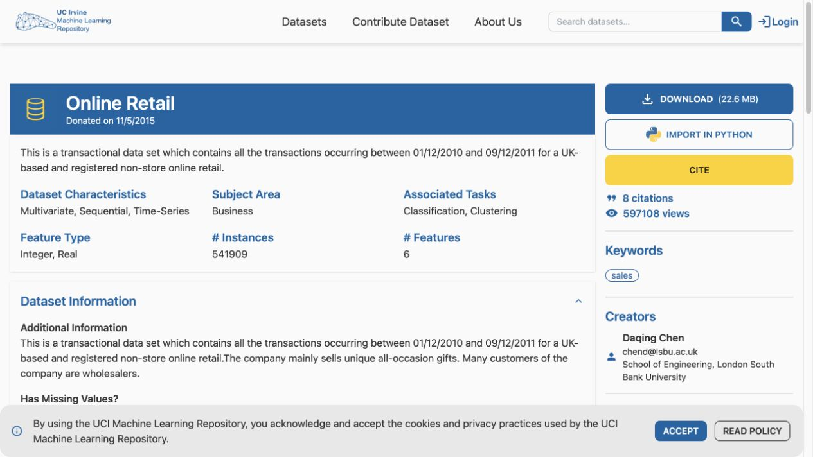
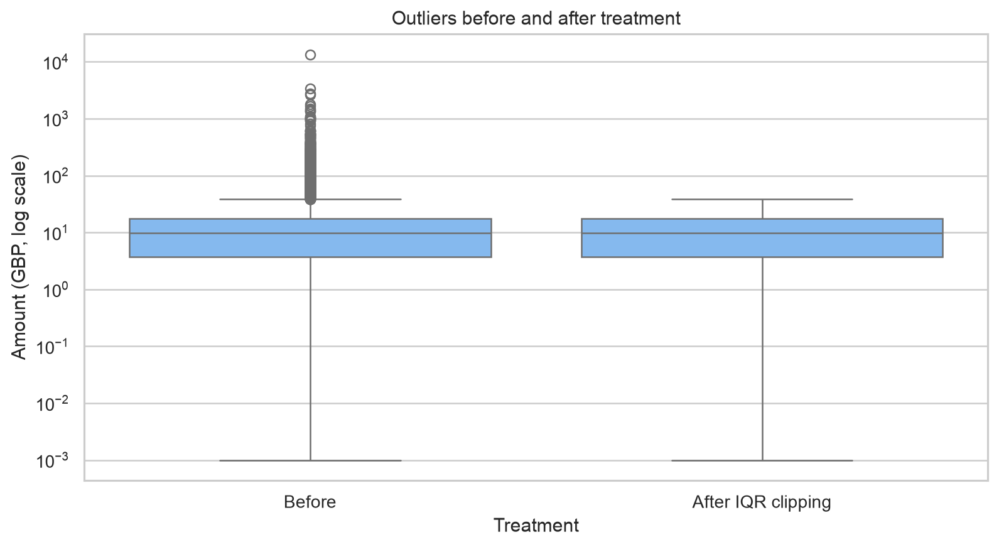
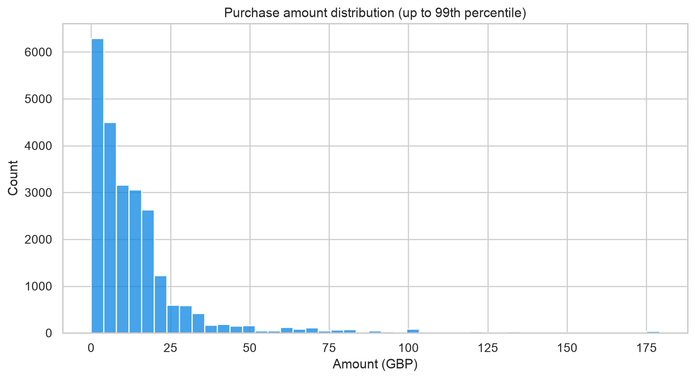
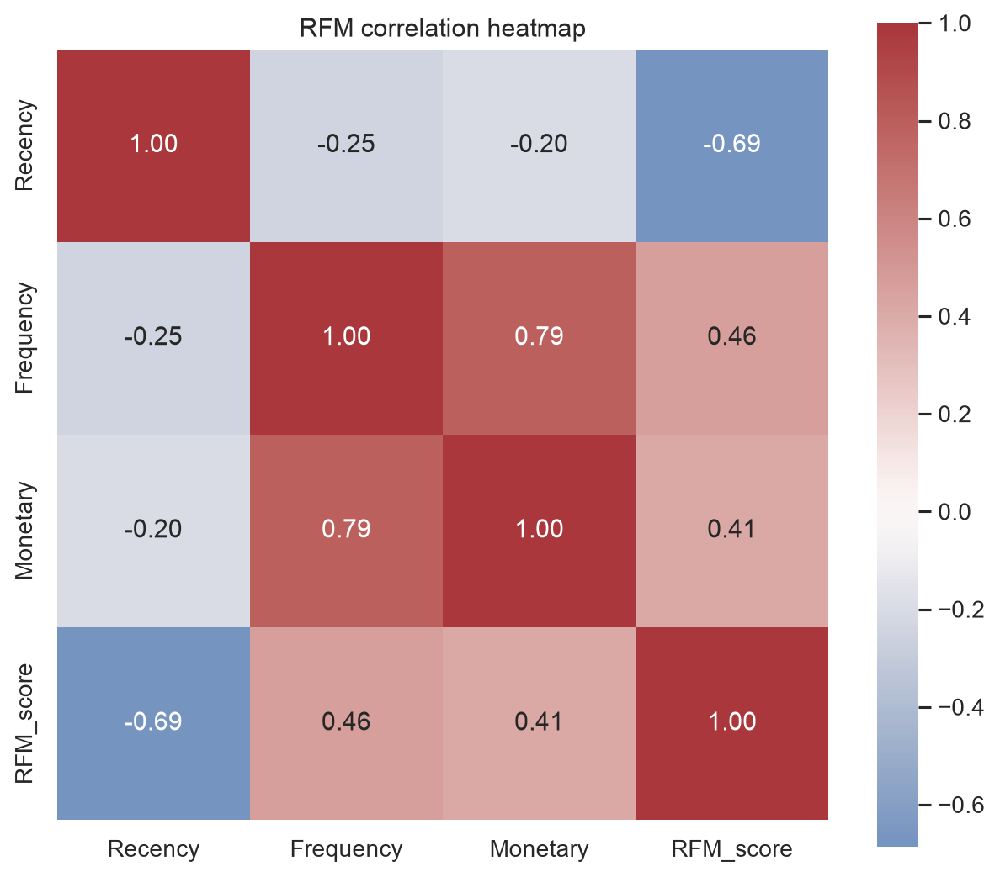
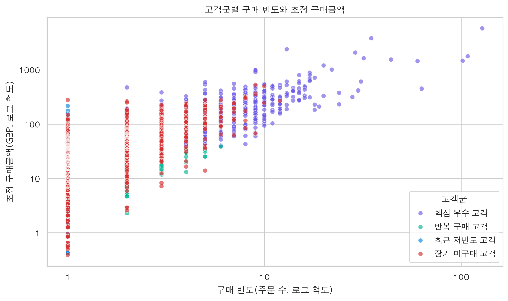
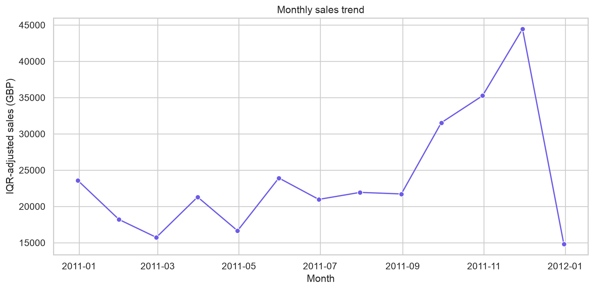

# A1-1 쇼핑몰 고객 분석과 RFM 세분화

25,000건의 쇼핑몰 거래에서 결측치와 이상치를 처리하고, 숫자·텍스트·이미지 배열 특징을 벡터화한 뒤 RFM으로 고객을 `VIP`, `Loyal`, `New`, `Churned` 네 그룹으로 분류한 재현 가능한 데이터 분석 프로젝트입니다.

## 핵심 결과

| 세그먼트 | 고객 수 | 고객 비중 | 평균 Recency | 빈도 중앙값 | 평균 Monetary | 조정 매출 비중 |
|---|---:|---:|---:|---:|---:|---:|
| VIP | 903 | 27.8% | 21.2일 | 4회 | £180 | 63.4% |
| Churned | 1,625 | 50.0% | 179.5일 | 1회 | £45 | 28.8% |
| New | 531 | 16.3% | 31.2일 | 1회 | £29 | 6.0% |
| Loyal | 192 | 5.9% | 27.6일 | 2회 | £25 | 1.9% |



분석 기준일은 마지막 유효 구매일 다음 날인 `2011-12-10`입니다. Monetary는 양수 구매금액에 IQR 클리핑을 적용한 뒤 합산했습니다. 따라서 표의 매출은 회계 매출이 아니라 세분화 비교용 **조정 금액**입니다.

## 데이터

- 출처: [UCI Online Retail](https://archive.ics.uci.edu/dataset/352/online%2Bretail)
- 인용: Chen, D. (2015). *Online Retail*. UCI Machine Learning Repository. <https://doi.org/10.24432/C5BW33>
- 라이선스: CC BY 4.0
- 원본 근거: 541,909행, 8개 원본 필드, 2010-12-01~2011-12-09
- 분석 데이터: seed 42로 추출한 25,000행, 14개 열



`product_image`는 실제 사진이 아니라 `stock_code`에서 결정론적으로 생성한 8×8 교육용 배열입니다. 실제 이미지 출처를 가장하지 않으면서 CSV 배열 파싱과 NumPy 이미지 통계 연습을 재현하기 위한 파생 필드입니다. 자세한 출처와 스키마는 [data/DATASET.md](data/DATASET.md)에 있습니다.

결측 규칙은 명시적입니다. 텍스트 `description`은 같은 상품 그룹의 최빈값, 그룹에도 값이 없으면 `UNKNOWN PRODUCT`로 대치합니다. 이미지 배열은 임의의 0으로 채우지 않으며, 비어 있거나 길이가 다르거나 NaN/무한대를 포함하면 `engineer_features()`가 오류를 발생시켜 품질 문제를 드러냅니다.

### 이미지 배열 사용 범위

현재 데이터는 실제 사진이 없어도 수치형·범주형·날짜형의 세 가지 원본 데이터 유형으로 평가 기준을 충족합니다. `product_image`는 별도의 이미지 배열 연산 항목을 재현하기 위한 네 번째 교육용 유형이며, `image_mean`과 `image_std` 계산 과정만 검증하는 데 사용합니다. 이 값으로 상품 색상·형태·품질 같은 시각적 비즈니스 결론을 내리지 않습니다. 실제 시각 특성이 필요한 후속 과제에서는 공개 라이선스 상품 이미지와 `stock_code`를 연결한 뒤 동일한 NumPy 파이프라인에 입력해야 합니다.

## 처리 방식

- `description` 결측 65건: 같은 `stock_code` 그룹의 최빈 설명으로 대치, 처리 후 0건
- `customer_id` 결측 6,300건: 식별자를 조작하지 않고 보존, RFM에서만 제외
- 숫자 특징: `amount = quantity * unit_price` NumPy 벡터 연산
- 텍스트 특징: 설명의 `word_count`
- 이미지 배열 특징: 25,000×64 행렬의 행별 `image_mean`, `image_std`
- 이상치: 직접 구현한 `Q1 - 1.5×IQR`, `Q3 + 1.5×IQR`; 양수 구매 1,925건을 클리핑, 처리 후 0건
- RFM: 유효 구매 18,270건, 고객 3,251명
- 타입 증거: `outputs/descriptive_statistics.csv`의 `dtype` 열과 `outputs/dtype_summary.csv`의 타입별 컬럼 수

### 시각화 제목·축 레이블 증거

모든 필수 시각화는 `scripts/run_analysis.py`에서 `ax.set(title=..., xlabel=..., ylabel=...)` 또는 이에 해당하는 명시적 설정으로 생성한다. 평가기가 PNG를 직접 열지 않아도 확인할 수 있도록 동일한 정보는 [`outputs/visualization_evidence.csv`](outputs/visualization_evidence.csv)에도 저장한다.

| 파일 | 종류 | 그래프 제목 | X축 레이블 | Y축 레이블 |
|---|---|---|---|---|
| `01_amount_histogram.png` | 히스토그램 | Purchase amount distribution (up to 99th percentile) | Amount (GBP) | Count |
| `02_outlier_boxplot.png` | 박스플롯 | Outliers before and after treatment | Treatment | Amount (GBP, log scale) |
| `03_segment_bar.png` | 막대그래프 | Customers by RFM segment | Segment | Customers |
| `04_rfm_heatmap.png` | 히트맵 | RFM correlation heatmap | RFM metrics | RFM metrics |
| `05_rfm_scatter.png` | 산점도 | Frequency vs monetary value by segment | Frequency (orders) | Monetary (GBP) |
| `06_monthly_sales_line.png` | 라인차트 | Monthly sales trend | Month | IQR-adjusted sales (GBP) |

#### IQR 처리 전후 박스플롯



#### 여섯 가지 필수 시각화 원본










### 공개 API와 설계 선택

| API | 책임 | 선택 이유와 대안 |
|---|---|---|
| `load_data()` | CSV 로드, 스키마 검사, 날짜·이미지 배열 파싱 | 잘못된 입력을 분석 후반이 아니라 경계에서 실패시킨다. 다양한 원천 스키마는 전처리 어댑터로 표준 열 이름에 매핑한다. |
| `handle_missing()` | 그룹별 텍스트 대치와 날짜 결측 제거 | 상품명은 `stock_code` 내부에서 반복되므로 전역 최빈값보다 상품 정체성을 보존한다. `drop`은 표본 손실이 있고, 고객 ID 평균 대치는 식별자를 조작하므로 사용하지 않는다. 기존 `handle_missing_values()`는 호환용 별칭이다. |
| `engineer_features()` | 숫자·텍스트·이미지 통계 생성 | `to_numpy()`와 `np.stack()`으로 동종 값을 연속 배열에 배치해 Python 객체 반복 비용을 줄이고 컴파일된 벡터 연산을 사용한다. |
| `detect_outliers()` / `treat_outliers()` | IQR 경계 계산, 탐지, clip/remove | 행 제거는 희소한 고액 구매자를 잃을 수 있어 원본을 보존하는 clip을 기본 분석에 사용한다. |
| `calculate_rfm()` | 유효 구매 집계, 사분위 점수, 네 세그먼트 생성 | 고정 비즈니스 임계값이 없는 탐색 단계이므로 순위 기반 사분위를 사용한다. 운영 단계에서는 실제 구매주기 임계값과 교체할 수 있다. |

주요 생성자 파라미터의 기본값도 명세와 이식성을 고려했습니다.

| 파라미터 | 기본값 | 근거 | 다른 환경에서의 권장 조정 |
|---|---:|---|---|
| `outlier_threshold` | `1.5` | Tukey의 표준 탐색 규칙으로 중간 수준의 이상치를 표시 | 정상 고액 주문이 많은 B2B는 `3.0`; 엄격한 품질 검사는 `1.0`도 비교 |
| `min_rows` | `1000` | 과제의 최소 데이터 규모를 실행 시 검증 | 단위테스트·PoC는 작게, 운영 배치는 기대 일별 최소 건수로 설정 |
| `min_columns` | `8` | 과제의 최소 필드 수를 실행 시 검증 | 다른 스키마는 필수 열 집합과 함께 조정하고 데이터 계약으로 관리 |

### 결측 대치의 통계적 근거와 위험

`description`은 범주형 상품명이므로 평균이 정의되지 않고, 같은 `stock_code`에서 가장 자주 관측된 최빈값이 가장 해석 가능한 대표값입니다. 전역 최빈값보다 오분류 위험이 작고 행 삭제보다 정보 손실이 적습니다. 그러나 그룹별 대치는 그룹 내부의 실제 표기 다양성과 분산을 줄이며, 상품 간 차이가 실제보다 또렷해 보이게 할 수 있습니다. 대치 여부 플래그를 후속 모델에 남기고, 대치 전후 분포와 원본 시스템의 상품 마스터를 함께 검증해야 합니다.

### IQR을 선택한 이유와 한계

IQR은 중앙 50%에 기반하므로 평균·표준편차 방식처럼 정규분포를 가정하지 않으며, 오른쪽 꼬리가 긴 구매금액에서 극단값 자체의 영향도 작습니다. 반면 심하게 비대칭인 실제 매출에서는 정상적인 대량 주문까지 이상치로 과다 탐지할 수 있고, 작은 그룹별 분포 차이도 무시합니다. 그래서 음수 반품은 보존하고 양수 구매에만 적용했으며, 행 삭제 대신 원본 `amount`와 클리핑한 `amount_clean`을 함께 남겼습니다. 박스플롯에는 처리 전 1,925건과 처리 후 0건 및 비율을 직접 표시합니다.

### 상관관계 해석

- `Frequency`–`Monetary` 상관계수는 **0.79**입니다. 더 자주 주문한 고객일수록 누적 조정 구매금액도 큰 경향이 있지만, 빈도 증가가 매출 증가의 원인임을 증명하지는 않습니다.
- `Recency`–`RFM_score` 상관계수는 **-0.69**입니다. 마지막 구매 후 시간이 길수록 종합 점수가 낮아지는 설계가 데이터에 반영됩니다. 두 변수는 점수 산식으로 연결되어 있어 독립적인 행동 발견으로 과대 해석하면 안 됩니다.

정확한 행렬은 [`outputs/rfm_correlations.csv`](outputs/rfm_correlations.csv)에 있습니다.

### 주요 수치형 변수의 기술 통계 해석

- `quantity`: 평균 9.51, 중앙값 3, 표준편차 43.22, Q1 1, Q3 10입니다. 평균이 중앙값보다 크고 표준편차가 큰 것은 대량 주문과 음수 반품으로 분포가 비대칭임을 보여주므로 일반 주문은 중앙값과 사분위 범위로 해석하는 편이 안전합니다.
- `unit_price`: 평균 £5.11, 중앙값 £2.08, 표준편차 £120.07, Q1 £1.25, Q3 £4.13입니다. 중앙 50%는 좁지만 일부 고가 품목이나 조정 거래가 전체 변동성을 크게 높입니다.
- `amount`: 평균 £17.49, 중앙값 £9.75, 표준편차 £131.27, Q1 £3.38, Q3 £17.40입니다. 평균이 중앙값의 약 1.8배이고 표준편차도 커 오른쪽 꼬리가 긴 분포이며, 이는 평균·표준편차 방식보다 IQR과 처리 전후 비교를 선택한 근거입니다.

수치는 반품과 취소를 포함한 원본 거래의 표본 통계입니다. RFM의 Monetary에는 유효 양수 구매와 IQR 조정 금액을 별도로 사용했습니다.

### 사분위 선택과 민감도

4분위는 사전 임계값이 없는 탐색에서 각 구간에 충분한 고객을 유지하고 네 운영 세그먼트와 연결하기 쉬운 절충안입니다. 3분위로 줄이면 경계가 거칠어 세그먼트가 커지고 서로 다른 고객이 합쳐질 수 있습니다. 5분위로 늘리면 상·하위 고객을 더 세밀하게 나누지만 작은 세그먼트와 경계 이동이 늘어 캠페인 운영이 불안정해질 수 있습니다. 따라서 현재 비율은 절대적인 고객 유형이 아니라 기준 선택의 결과이며, 운영 전 30/90/180일 Recency와 최소 주문 횟수·LTV 같은 비즈니스 임계값으로 민감도 검증을 해야 합니다.

### 대규모 이미지 배열 병목과 대응

현재 25,000×64 배열은 `float32`로 계산해 핵심 행렬이 약 6.1 MiB이지만, CSV 문자열과 행별 Python 객체 오버헤드가 추가됩니다. 541,909행 전체를 한 번에 `np.stack()`하면 핵심 행렬만 약 132 MiB이고 파싱 객체 때문에 실제 메모리는 더 큽니다. 운영 규모에서는 (1) CSV 대신 Parquet/NumPy 바이너리, (2) 청크별 파싱·통계 후 즉시 원본 배열 해제, (3) `float32` 또는 원본 `uint8` 유지, (4) `memmap`/분산 프레임, (5) 프로파일링 후 CPU 병목일 때만 병렬화, (6) 초기 EDA는 국가·월을 보존하는 층화 표본이나 점진적 샘플링을 적용합니다. 데이터 전체 복사본을 여러 프로세스에 전달하는 병렬화는 오히려 메모리를 악화시킬 수 있습니다.

## 비즈니스 제안

### 인사이트 1 — VIP 고객 유지

**(근거)** VIP 고객은 전체 고객의 **27.8%**이지만 조정 매출의 **63.4%**를 차지합니다. 따라서 상대적으로 적은 고객 집단에서 전체 조정 매출의 대부분이 발생하고 있습니다.

**(실행)** VIP 고객을 대상으로 전용 혜택이나 멤버십 프로그램을 제공하고, 첫 2주 동안 혜택 비용과 마진 기준을 설정한 뒤 4주간 캠페인을 운영합니다. 이후 **90일 반복구매율과 이탈률**을 대조군과 비교합니다. 기대 효과는 핵심 고객의 이탈을 줄이고 주요 매출 기반을 유지하는 것입니다.

**(검증)** 캠페인 집단의 90일 반복구매율 또는 이탈률이 대조군보다 개선되지 않거나, 혜택 비용을 반영한 증분 공헌이익이 0 이하라면 VIP 혜택 강화가 유지율과 수익성 개선에 효과적이라는 가설은 지지되지 않습니다.

### 인사이트 2 — Churned 고객 재활성화

**(근거)** Churned 고객은 전체 고객의 **50.0%**이며 평균 Recency는 **179.5일**입니다. 분석 고객 중 절반이 장기간 구매하지 않은 상태이므로 재활성화 가능한 고객 규모가 큽니다.

**(실행)** Churned 고객을 대상으로 2주간 캠페인을 준비하고 이후 4주 동안 기간 제한 할인 또는 재구매 인센티브를 무작위 대조 실험으로 제공합니다. 대조군과 비교해 재활성화율, 증분 매출, 공헌이익, 수신거부율을 측정합니다. 기대 효과는 장기 미구매 고객 일부를 다시 구매 고객으로 전환하는 것입니다.

**(검증)** 할인 없이 자연스럽게 재구매하는 고객과 실제 캠페인 효과를 구분하려면 **무작위 대조군 데이터와 이탈 사유 데이터**가 추가로 필요합니다. 대조군 대비 재활성화율이나 증분 공헌이익이 개선되지 않으면 이 캠페인의 효과는 지지되지 않습니다.

### 인사이트 3 — New 고객의 두 번째 구매 유도

**(근거)** New 세그먼트는 **531명**이며 구매 빈도의 중앙값은 **1회**입니다. 따라서 상당수가 첫 구매 이후 반복 구매로 이어지지 않은 신규 고객입니다.

**(실행)** 첫 구매 후 14일 이내에 상품 사용 가이드와 연관 상품 추천을 제공하고, 이후 **14일 및 30일의 두 번째 구매율**, 클릭률, 반품률을 추적합니다. 기대 효과는 신규 고객이 첫 구매에서 반복 구매 단계로 전환될 확률을 높이는 것입니다.

**(검증)** 추천을 받은 고객의 14일 또는 30일 두 번째 구매율이 대조군보다 높지 않거나 반품률 증가로 인해 순효과가 사라진다면 온보딩 추천이 반복 구매를 증가시킨다는 가설은 지지되지 않습니다.

> 위 제안은 관찰 데이터에서 얻은 가설이며 인과관계를 뜻하지 않습니다. 실제 효과는 위에서 제시한 대조군 비교와 후속 데이터를 통해 검증해야 합니다.

| 우선순위 | 핵심 KPI | 검증 기간 | 비용·품질 가드레일 |
|---:|---|---|---|
| 1 VIP | 조정 매출 유지율, 반복구매율, 90일 이탈률 | 90일 | 혜택 비용/증분 공헌이익 |
| 2 Churned | 대조군 대비 재활성화율, 증분 매출 | 6주 | 할인비, 공헌이익, 수신거부율 |
| 3 New | 14/30일 2회차 구매율 | 30일 | 추천 클릭률, 반품률 |

## 머신러닝 확장 설계

- **권장 타깃:** 기준일 이후 90일 동안 구매가 없으면 `churn_90d=1`, 구매가 있으면 `0`인 이진 분류
- **관측창 피처:** 기준일 이전의 `Recency`, `Frequency`, `Monetary`, 평균 주문금액, 반품률, 고유 상품 수, 활동 개월 수, 국가, 최근 30/60/90일 주문 수와 금액, 대치 여부 플래그
- **누수 방지 제외 항목:** 타깃 기간의 주문·금액, 미래 날짜, 사후 계산 RFM 세그먼트, 캠페인 결과
- **평가:** 시간순 train/validation/test 분할, Recall·Precision·PR-AUC·ROC-AUC·확률 캘리브레이션, 캠페인 비용을 반영한 기대가치

클래스 불균형이 예상되므로 Accuracy만으로 모델을 선택하지 않으며, 최종 타깃 기간과 피처 관측창은 실제 재구매 주기에 맞춰 확정합니다.

## 실행 방법

Python 3.8 이상이 필요합니다.

### 필수 분석 환경

실제 데이터 분석에는 과제에서 허용한 **NumPy, Pandas, Matplotlib, Seaborn**만 사용합니다.

`requirements.txt`에는 다음 네 가지 분석 라이브러리만 포함합니다.

```text
numpy>=1.24,<1.25; python_version == "3.8"
numpy>=1.25; python_version >= "3.9"
pandas>=2.0
matplotlib>=3.7,<3.8; python_version == "3.8"
matplotlib>=3.8; python_version >= "3.9"
seaborn>=0.13
```

환경 마커는 과제의 최소 버전인 Python 3.8에서도 설치되게 하면서, Python 3.9 이상에서는 최신 호환 버전을 선택하기 위한 것입니다. 라이브러리 종류는 여전히 과제에서 허용한 네 가지뿐입니다.

기본 분석 환경은 다음과 같이 구성하고 실행합니다.

```bash
python3 -m venv .venv
source .venv/bin/activate

python -m pip install --upgrade pip
python -m pip install -r requirements.txt

python -m unittest -v
python -m scripts.run_analysis
```

Windows PowerShell에서는 가상환경 활성화 명령을 다음과 같이 사용할 수 있습니다.

```powershell
.venv\Scripts\Activate.ps1
```

### 개발 및 전체 재현 환경

노트북 재생성, 실행 검증, 원본 Excel 데이터 재처리 등 프로젝트 개발·재현 작업이 필요한 경우에는 개발용 의존성을 추가로 설치합니다.

`requirements-dev.txt`는 다음과 같이 `requirements.txt`를 포함한 뒤 개발 도구를 추가합니다.

```text
-r requirements.txt

jupyter>=1.0
nbformat>=5.9
nbclient>=0.10
openpyxl>=3.1
```

설치는 다음과 같이 수행합니다.

```bash
python -m pip install -r requirements-dev.txt
```

이후 실행 완료 노트북을 다시 생성하고 프로젝트 전체를 검증할 수 있습니다.

```bash
python scripts/build_notebook.py
python scripts/verify_project.py
```

`requirements.txt`에는 과제에서 허용한 분석 라이브러리인 **NumPy, Pandas, Matplotlib, Seaborn만 포함**합니다.

`requirements-dev.txt`의 `jupyter`, `nbformat`, `nbclient`, `openpyxl`은 분석 알고리즘이나 EDA를 대체하기 위한 라이브러리가 아닙니다. 이들은 각각 노트북 실행·저장·검증과 원본 Excel 데이터 재처리를 위한 **개발 및 재현 도구**로만 사용합니다.

따라서 제출 분석 로직은 `requirements.txt`의 네 가지 허용 라이브러리만으로 실행할 수 있으며, 추가 개발 도구는 별도의 `requirements-dev.txt`로 분리했습니다.

### 원본 데이터 재생성

원본에서 표본 CSV를 다시 만들려면 개발용 의존성을 설치한 후 다음을 실행합니다.

```bash
python scripts/prepare_data.py
```

네트워크 없이 받은 원본 파일이 있다면 다음과 같이 사용할 수 있습니다.

```bash
python scripts/prepare_data.py --raw-xlsx "/path/to/Online Retail.xlsx"
```

### 노트북 실행 증거

`scripts/build_notebook.py`는 `nbclient.NotebookClient`로 모든 코드 셀을 실행한 뒤 노트북을 저장합니다. 최근 실행은 코드 셀 8개가 모두 완료되고 오류 출력이 0개였습니다.

기계 판독 가능한 [실행 리포트](outputs/notebook_execution_report.json)에는 시작·종료 시각, 실행 시간, Python 버전, 셀 실행 번호, 오류 수, 노트북 SHA-256이 있고, [성공 로그](outputs/notebook_execution.log)는 평가 제출용 간단한 무에러 증거를 제공합니다.

## 프로젝트 구조

```text
data/                     데이터, 출처·라이선스, 출처 캡처
docs/                     단계별 실행 순서와 방법론·위험 설명
figures/                  6종 이상 시각화, 요약 표, CAPTIONS.md
notebooks/analysis_report.ipynb
outputs/                  RFM, dtype·상관 통계, 품질·실행 증거, 인사이트
scripts/                  데이터 준비·분석·노트북·검증 실행기
src/pipeline.py           재사용 가능한 DataAnalyzer 클래스
tests/                    IQR, 결측, 벡터 특징, RFM 테스트
requirements.txt          과제 허용 분석 라이브러리
requirements-dev.txt      노트북 빌드·검증·원본 데이터 준비용 개발 의존성
```

## 한계

- 원본 전체가 아닌 25,000행 표본이므로 전체 모집단의 정확한 추정치가 아닙니다.
- 고객 ID 결측 거래는 고객 수준 RFM에서 제외됩니다.
- 파생 이미지 배열은 시각적 상품 의미를 갖지 않습니다.
- 반품/취소는 RFM 구매에서 제외했으며 별도 반품 분석이 필요합니다.
- 2011년 12월은 9일까지만 포함된 부분 월입니다.

구현 과정은 [상세 구현 가이드](docs/IMPLEMENTATION_GUIDE.md), 동료 검토를 진행할 때 확인할 순서와 설명 포인트는 [동료 검토 진행 가이드](docs/PEER_REVIEW_GUIDE.md), 실제 분석 설명과 출력은 [실행 완료 노트북](notebooks/analysis_report.ipynb)에서 확인할 수 있습니다.
